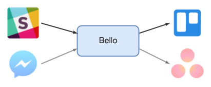

# Bello
A Slack chatbot using Trello to manage tasks in a ["Bullet Journal"](http://bulletjournal.com/)-ish fashion.

## Overview
While Bello uses Slack and Trello right now, it is generally concepted to allow easily interchanging those services to e.g. Messenger and Asana as shown below.

